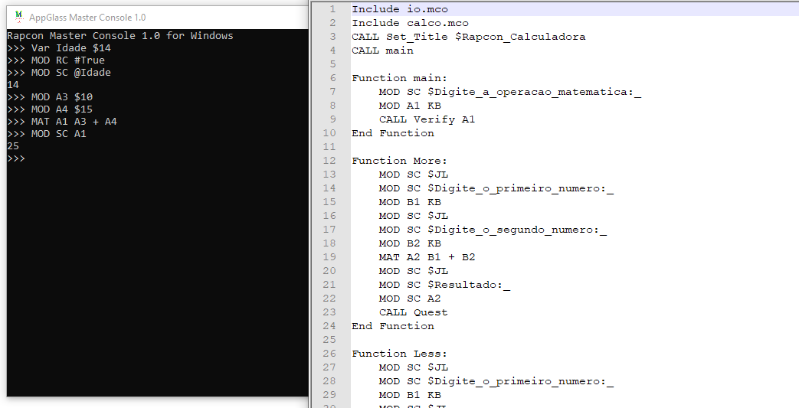

# MasterConsole
A really simple and small scripting language




# Context
Master Console is one of my first C# code i ever coded, it was coded in 2012 originally using VB.NET and later i made and improved it in C#, since i was just 13 years old and did not 
knew compilation steps and their architecture obviously it is not a great thing to use it for any serious project.

This project was probably what makes me learn how to deal with strings since most of it is made of Split, IndexOf and Array operations and doesn't use any lexical/semantical/syntatic analisys.

# Simplicity
The simplicity was based on Assembly, most of the commands are formed by 3 or 4 words splited by spaces but since it is not a low level language it is much easier than Assembly.

Even know the project is really small and simple there are some really cool exemples in the 'Examples' folder, since Hello World, simple IO, File operations, conditional operators, functions, string concatenation, timer and even a whole calculator coded using my language.

There is also a full documentation about every command in the 'Docs' folder.

# The Hello World
Here is a simple Hello World using the Master Console Language:

```
* Exemplo de Helo World *
* Ativa o RC para uso de espa�os *
MOD RC #True

* Muda a area A1 *
MOD A1 $Helo_World

* Muda o valor da tela *
MOD SC A1

* Pausa *
Pause APK
```

Most of the values used to be stored on internal interpreter registers, there are several types of registers, like the value registers (prefix A), there is also IO register such as SC (SCreen) and KB (KeyBoard) that reads any keyboard input until the user press enter.

Here is another example opening a file using the language:

```
MOD RC #True

Area LoopA

MOD SC $Escreva_o_diretorio_do_arquivo:_
MOD B1 KB

FileExists A1 B1

If A1 = $1
GoTo Read

MOD SC $JL
MOD SC $Este_diretorio_nao_existe!
MOD SC $JL
GoTo LoopA

Area Read
CALL Read B1
Function Read:File
    MOD SC $JL
    FileReadAllText A1 @File
    
    MOD SC $JL
    MOD SC A1
    MOD SC $JL
    MOD SC $Deseja_abrir_outro_arquivo?_[S=Sim/N=Nao]
    MOD B2 KB
    If B2 = $S
    GoTo LoopA
    
    GoTo Final
End Function

Area Final
```
Some of these functions are internal functions for very specific purposes such as the 'FileExists', 'FileReadAllText' and others.

# How to run Master Console Scripts?

Master Console scripts uses the '.mco' extensions, you can just open the file with the compiled executable or pass the file path by command line argument.

# How to compile it?

It is a really simple single file C# project and it doesn't require any external library, you just need to open the solution using the Visual Studio and compile it.

# There is more?

Yes, this project was one of my first interpreted languages and even know it's very simple i really like to look back in the day to my old projects and see how i improved. After
this language i also create some other high level languages interpreted and compiled languages that can even interact with the operating system calling dll functions and much more!